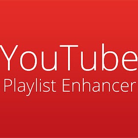

# Has Youtube Playlists Enhancer

## Repository for Youtube plugin I'm making to give playlists additional functionality

### Aditional Functionality is as follows:

- [Playlist Search](https://github.com/HasanBradfordUni/YoutubePlaylistsEnhancer#playlist-search-)
- [Directly Add](https://github.com/HasanBradfordUni/YoutubePlaylistsEnhancer#directly-add-)
- [Duration Details](https://github.com/HasanBradfordUni/YoutubePlaylistsEnhancer#duration-details-)

## Playlist Search  
### This feature enables the user to search through a playlist for any videos they want to find in the playlist

## Directly Add  
### This feature enables the user to add any video via serach or url to the playlist

## Duration Details  
### Allows the playlist to display the total duration and projected time of finishing 
For Duration Details see [this source code](https://github.com/nrednav/youtube-playlist-duration-calculator) 

